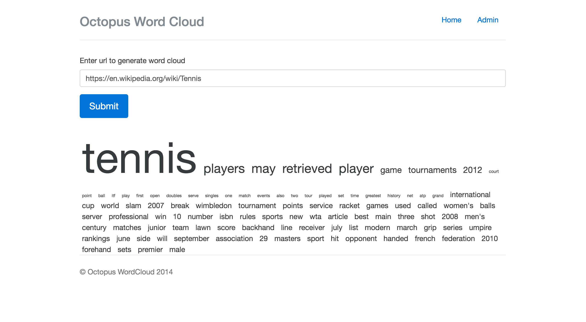
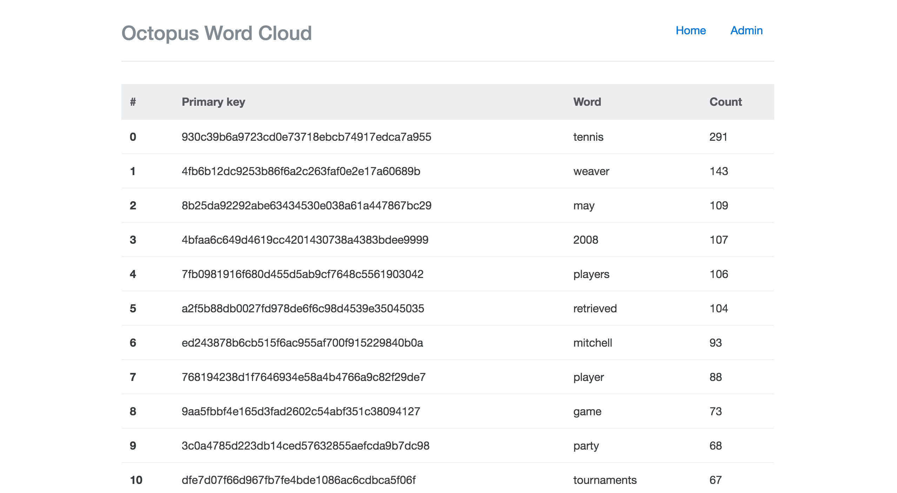

WordCloud
==========

Word cloud generator that runs on Google App Engine using MySQLdb and Tornado.

Installation
------------

First install the [Google App Engine Python SDK](https://cloud.google.com/appengine/downloads#Google_App_Engine_SDK_for_Python).

```bash
$ git clone https://github.com/rpip/wordcloud
$ cd wordcloud
$ # install deps
$ pip install -t lib -r requirements.txt
$ # set DB config vars in app.yaml. Defaults to 'root' as user 'localhost' as host
$ dev_appserver.py .
```

Usage
-----

The `WordCloud` class in `wordcloud.py` does the heavy lifting, and can be used independently of the web app.

```python
from wordcloud import WordCloud
frequencies, word_cloud = WordCloud().generate('http://fsf.org')
```


Note
------

- Follow the [Twelve-Factor App](http://12factor.net/config) methodology and use environment variables for the configs. There's a way to set the system environment variables using `appcfg.py -E OCTOPUS_KEYFILE:keyfile, OCTOPUS_DEBUG:True`. This is consistent with the 12-Factor App methodology which recommends storing configs as system environment variables. This can be combined with Ansible to update or set the `env_variables` in `app.yaml`.

- The asymmetrical encryption uses an RSA key file with the pycrypto RSA tools. I think this offers better security than the DES/ECB approach but  it’s more computationally expensive. I store the encrypted data as binary in the database, and on read, I decrypt it. I tried some compression algorithms like zlib and bzip to reduce the size of the encrypted word but the results were not encouraging. But for now this works. We are able to to securely encrypt and decrypt the words.

- Include digits in the word count?

Screenshots
------------






TODO
------
- [x] Deploy app
- [] Handle HTTP redirects
- [x] Encrypt/decrypt word saved in the DB
- [] Write unit tests for wordcloud.WordCloud
- [] Setup TravisCI
